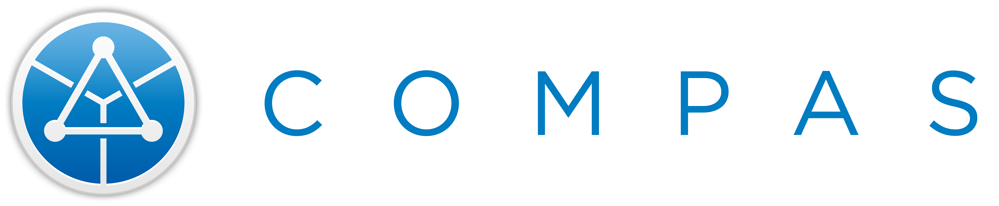

# compas-graphics

These graphic assets are meant to be used to brand, identify and keep all COMPAS-related projects and content consistent and recognizable across all its uses.

## Color
The primary color of COMPAS is the "COMPAS blue", #0092d2 or rgb (0, 146, 210).

Whenever possible, use one of the "COMPAS blue" variations:
- "compas_default": For most use cases.
- "compas_default_shadow": When a little bit of contrats around the white ring of the COMPAS logo is needed.
- "compas_gradient": For presentation purposes when more color variation or vibrancy is needed (for example, as shown in this README file above on white background).

The full white or black versions are to be used when full color will not have enough contrast, typically when the logo is placed on top of a photo or video (such as the COMPAS 1.0 splash screen).

## Community Badge
If you create videos, tutorials, research projects, papers or any other content using COMPAS, you can give COMPAS credit by adding this badge to your thumbnails. The purpose of this badge is to unify all community-made COMPAS-specific content around the web.

  

## Usage guidelines
1. Do not use the COMPAS logo as your own logo.
2. Always scale all logos proportionally, and do not make the height of any COMPAS logos less than 50 pixels in height.
3. Do not alter the logo's colors, typography, proportions or spacing.
4. Do not recreate the logo.
5. Maintain a good amount of space around the logo, and do not overlap with other text, images or other elements.
